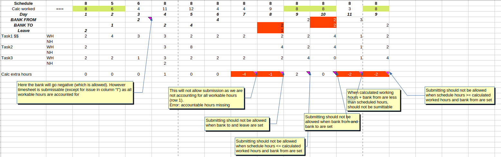

# BankOfHours (NOT IMPLEMENTED YET!)

_Django Model: core.TimeEntry_

Bank Of Hours is place where <glossary:Resource> can deposit or get hours from. Hours are saved on <glossary:TimeEntry> model on fields bank_from and bank_to.
Value of bank is calculated by adding values bank_to and subtracting bank_from for every <glossary:TimeEntry> assigned to <glossary:Resource>.
Note that value of bank can be negative when sum of bank_from > bank_to

## When hours can be added to bank?
<glossary:Resource> can add hours to bank when number of hours worked for selected day > working_schedule for that day.

You cannot add hours to bank when there is logged holiday, sick day, leave etc. for that day.

## When hours can get hours from bank?
<glossary:Resource> can get hours from bank when number of hours worked for selected day < working_schedule for that day.

You cannot get hours from bank when there are overtime hours for that day.

For examples when <glossary:Resource> can or cannot deposit/withdraw hours check that table:
{ style="width:100%; display:block; margin:auto;" }
