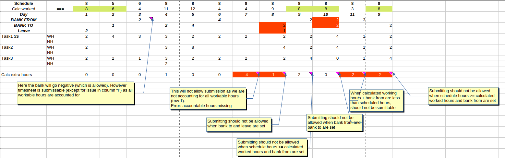

# BankOfHours

Bank of Hours transactions are recorded on the <glossary:DayEntry> model in its signed `bank` field. A positive value adds hours to the bank; a negative value uses hours from the bank.

The bank balance for a <glossary:Resource> is the sum of the `bank` values on their day entries. The balance can be negative.

## When hours can be added to bank?
<glossary:Resource> can add hours to bank when number of hours worked for selected day > working_schedule for that day.

You cannot add hours to bank when there is logged holiday, sick day, leave etc. for that day.

## When hours can get hours from bank?
<glossary:Resource> can get hours from bank when number of hours worked for selected day < working_schedule for that day.

You cannot get hours from bank when there are overtime hours for that day.

For examples when <glossary:Resource> can or cannot deposit/withdraw hours check that table:
{ style="width:100%; display:block; margin:auto;" }
