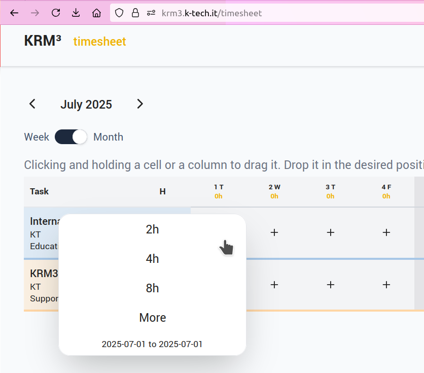
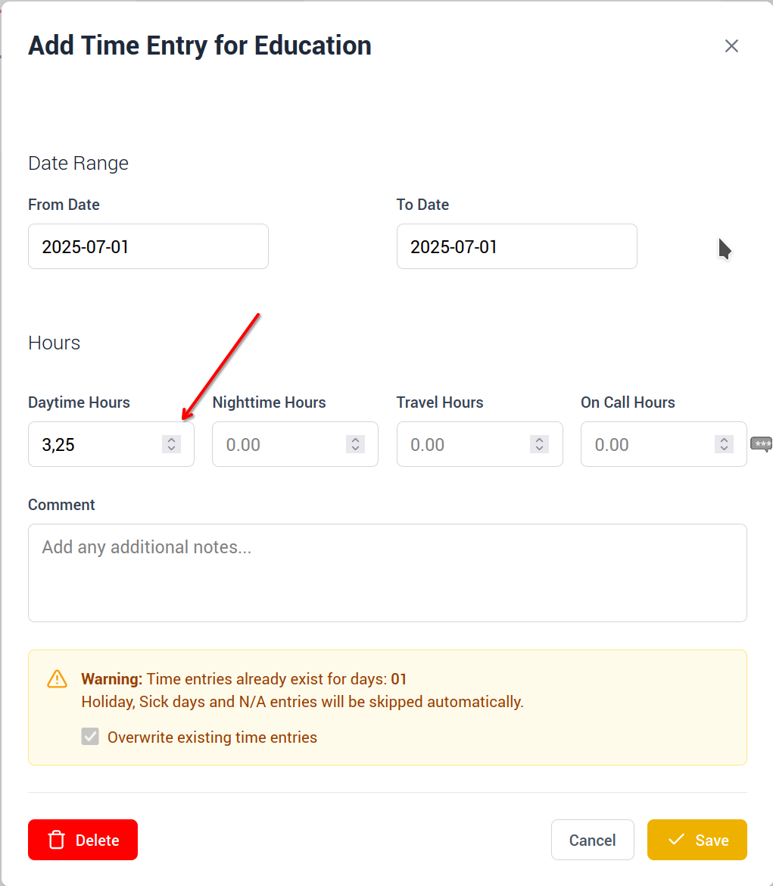
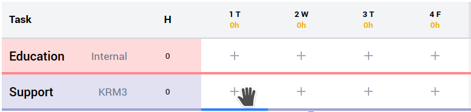
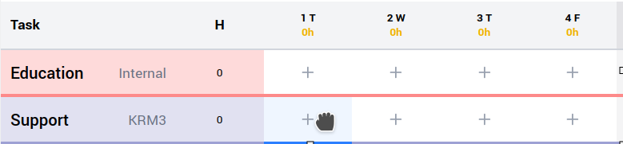
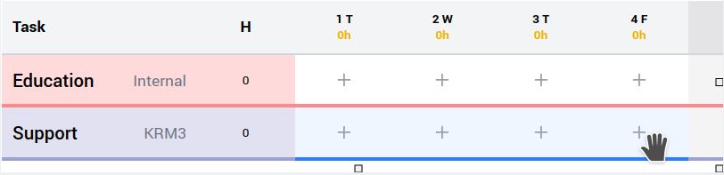
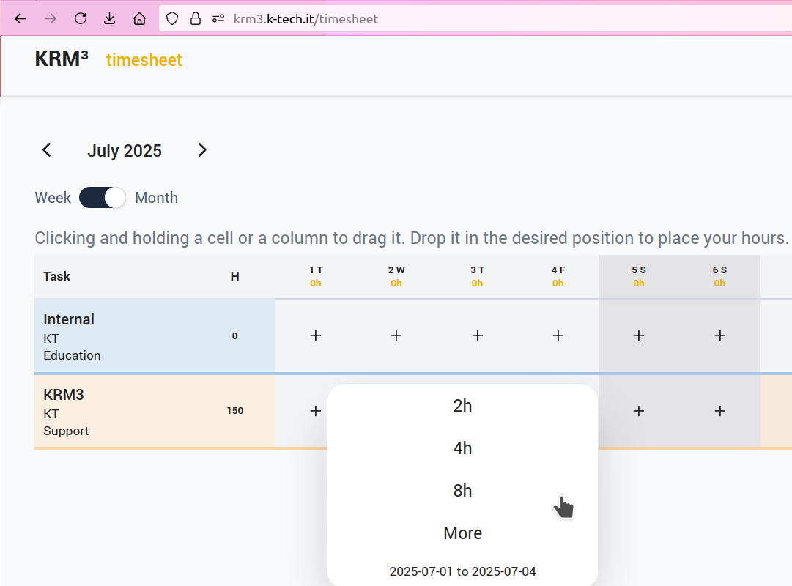
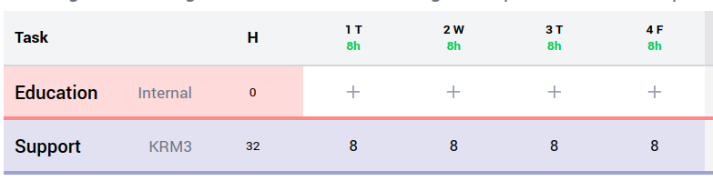

# # How to add hours to the task

Click + symbol under the designated day and you will be presented with a popup:

If you wish to add anything different from the, 2h, 4h or 8h selection, from the popup box, then click More. This allows you to add, in increments of 0.25 hours, you can also add a comment, for the amendment. Once you are happy, then click Save, or cancel or delete, if not.

# # How to add hours to all the week

If you want to add 8 hours for all the week for the same task, you can put mouse on July 1:

Click with the left key on the first day, July 1st:

Clicking and holding a cell or a column to drag it, till july 4th, you will see the blue line selecting all the days from 1st to 4th July:

When you will release the button select 8h for all the days:

