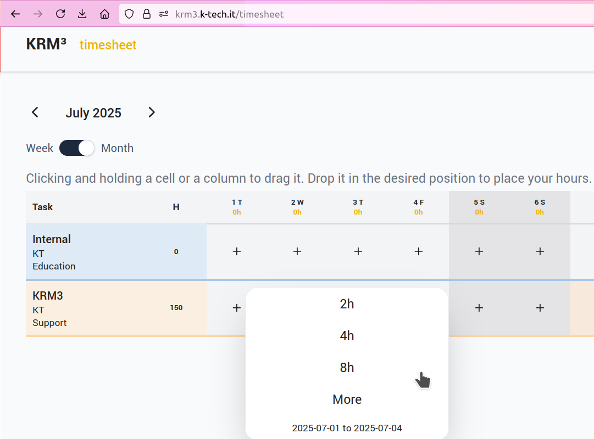

# # Welcome to KRM3 for user

See the [Glossary](./glossary/index.md) for a list of common KRM3 terminology

Connect to the following link: https://krm3.k-tech.it/ to see the new KRM3 project:

Click on "Timesheet" and you will see the project you are currently working on (If you don't have any Task, ask to Giovanni or Luca Salvator to add one for you):

<!-- -->

# # How add hours to the task

Now you're ready to add hours to your task, to do so, click on "+" symbol under the designated day and you will see a popup:

You can choose how many hours to add: 2h, 4h, 8h or custom clicking on "More" (You can increment from discrete value of 0,25h):

# # How remove hours to the task

If you added 2h and now you want to remove these hours you can click "More" and after click on "Delete"

# # How add hours to all the week

If you want to add 8 hours for all the week for the same task, you can put mouse on July 1:

Click with the left key on the first day, July 1st:

Clicking and holding a cell or a column to drag it, till july 4th, you will see the blue line selecting all the days from 1st to 4th July:

When you will release the button select 8h for all the days:

# # How add Day Entry as Holiday, Sick Day, Leave, Rest.

If you click on the number of the day, for example "14 M" you will see the following menu (If you want select more days as said in the previous chapter):

Now click on the choosen Entry Type and click "Save". You can select more days also changing date in "From day" and "To day". The menu "Day Entry" will not be available for Saturday and Sunday.
