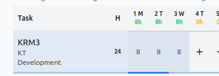
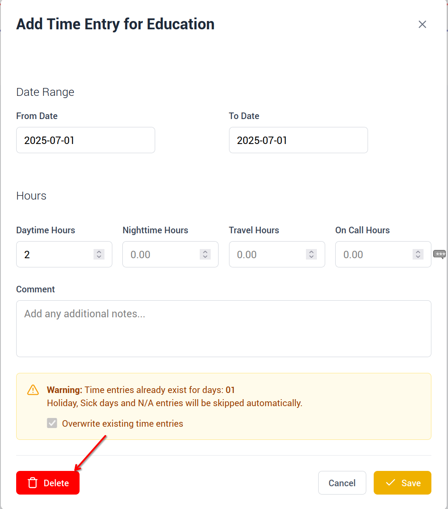

# # How to remove hours from a task

Select hours you want to remove

{ style="width:40%; display:block; margin:auto;" }

Click 'More' from the popup box, then click delete and the hours will be removed

{ style="width:60%; display:block; margin:auto;" }
