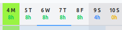
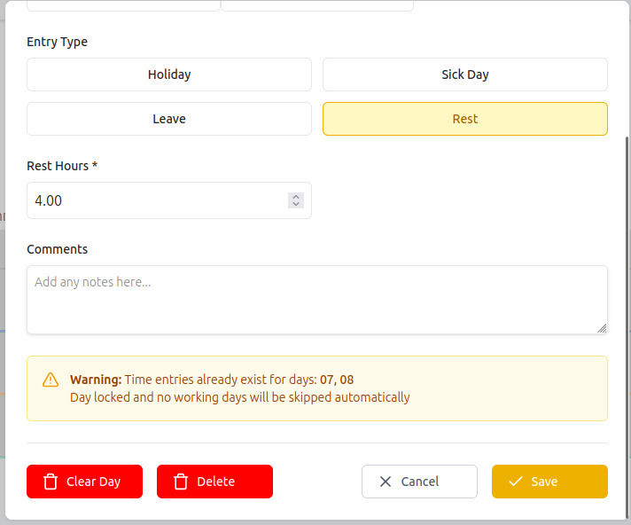

# # How to remove hours from a day

Select days from which you want to delete hours

{ style="width:40%; display:block; margin:auto;" }

## # How to delete every logged hours from selected days

To delete every logged hours from selected days you should click 'Clear Day'. It will delete not only day entries(holidays, leaves etc.), but also task entries!

{ style="width:60%; display:block; margin:auto;" }

## # How to remove only leave, special leave, rest

To delete only leaves, special leaves, rests you should click 'Delete' button. It will not affect task entries.
