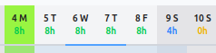
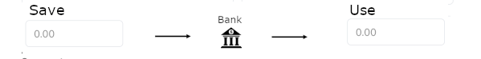

# # How to add or use hours from the Bank of Hours

To add/get hours from  <glossary:BankOfHours> start by selecting days:

{ style="width:60%; display:block; margin:auto;" }

In Day Entry window you should see:
{ style="width:60%; display:block; margin:auto;" }

To add hours to the bank, enter the number of hours in the 'Save' field. To use hours from the bank, enter the number in the 'Use' field. After entering the amount, click 'Save' to apply the change.

For information when you can add/get hours from bank check <glossary:BankOfHours>
