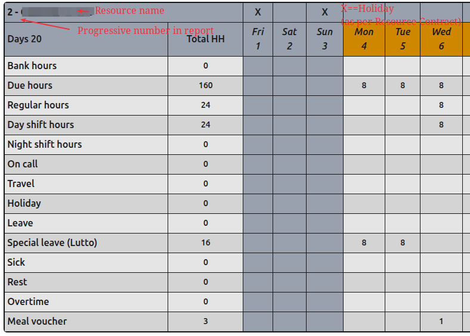

# Timesheet Report

The timesheet report is the most important report in the system for the timesheets.
Payslips are generated from this report.
The report is available as first menu entry in the menu `Reports`.

# Layout

There are several tables in the report: one for each Resource, sorted by Resource surname and name.
Only the Resources with 'Preferred in report' field set to 'Yes' are shown.

Example of table:

Each Resource table is organised as follows:

1st row:
  - A progressive number (in report) followed by the Resource surname and name.
  - An "X" denotes the corresponding day in the month (which is specified in row 2) is a holiday according to the Resource Contract Country Calendar.

2nd row:
  - Label "Days" followed by the number of the Resource _Working Days_ (see [General Definitions](#general-definitions)) in the month.
  - Label "Total HH" (Total Hours) followed by the calendar days in the month. In this colum we will show the sum of the values in the columns 3 onwards.

Following rows (see [Definitions for each calendar Day](#definitions-for-each-calendar-day)): Bank hours, Due hours, Regular hours, Day shift hours, Night shift hours, On Call, Travel, Holiday, Leave, Sick, Rest, Overtime, Meal Voucher

# General Definitions
  - Working Day: a day the Resource is expected to work according to its _Working Schedule_ (see following Definition)
  - Working Schedule: the number of hours the Resource is expected to work per week day (set in Resource Contract). [Due Hours calculations](rules.md#due-hours) may override this number in a calendar day.

# Definitions for each calendar Day

## Regular fields:

- Bank hours: A positive number shows the number of bank hours the Resource produced (deposits). A negative number shows the number of bank hours the Resource consumed (withdrawals).
- Due hours: The number of hours the Resource is expected to work in the day (see [Due Hours calculations](rules.md#due-hours)).
- Travel: The number of hours the Resource travelled in the day (denormalised from TaskEntry children).
- Day shift hours: The number of hours the Resource worked in the day during the Day Shift (denormalised from TaskEntry children).
- Night shift hours: The number of hours the Resource worked in the day during the Night Shift (denormalised from TaskEntry children).
- On Call: The number of hours the Resource was on call in the day (denormalised from TaskEntry children).
- Leave: The number of hours the Resource was on leave in the day.
- Special leave: The number of hours the Resource was on Special Leave in the day.
- Special leave Reason: The number of hours the Resource was on Special Leave in the day.
- Protocol Number: The protocol number for the Sick day
- Sick: The number of hours (equivalent to the expected Due Hours) the Resource was sick in the day.
- Rest: The number of hours the Resource was on rest in the day.
- Overtime: The number of hours the Resource earned as overtime in the day (see [Overtime Calculations](rules.md#overtime)).
- Meal Voucher: 1 if the meal voucher was earned by the Resource in the day (see [Meal Voucher Calculations](rules.md#meal-voucher)).

## Calculated properties:

- Holiday hours: The number of hours (equivalent to the expected Due Hours) the Resource was on holiday in the day.
- Worked hours: A property calculated as the sum of Day Shift + Night Shift + Travel Hours recorded in the TaskEntries
- Regular hours: A field representing the Resource _Worked hours_ + the bank daily balance up to maximum the expected number of hours (Due Hours).
- Remaining hours: The number of hours the Resource is expected to work in the day (Due Hours) minus the number of hours the Resource worked in the day, or 0 if the Resource worked more than the expected number of hours (Due Hours).

# Rules and Calculations

All the rules used to calculate the values shown in this report are listed in the
[Timesheet Calculation Rules](rules.md) page.
