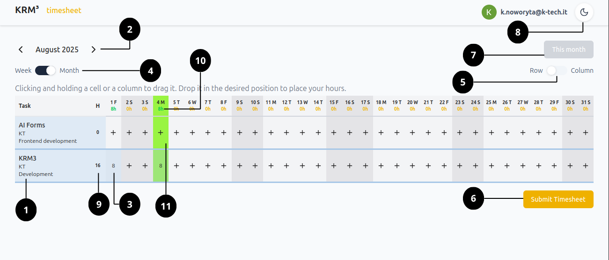

# # Timesheet overview
{ style="width:100%; display:block; margin:auto;" }

1. Task description
2. Month/week selection
3. Task cell
4. Month/week view switch
5. Row/column view switch
6. Submit button
7. Current month/week button
8. Dark mode switch
9. Total hours for task
10. Total hours for day
11. Current day highlight
