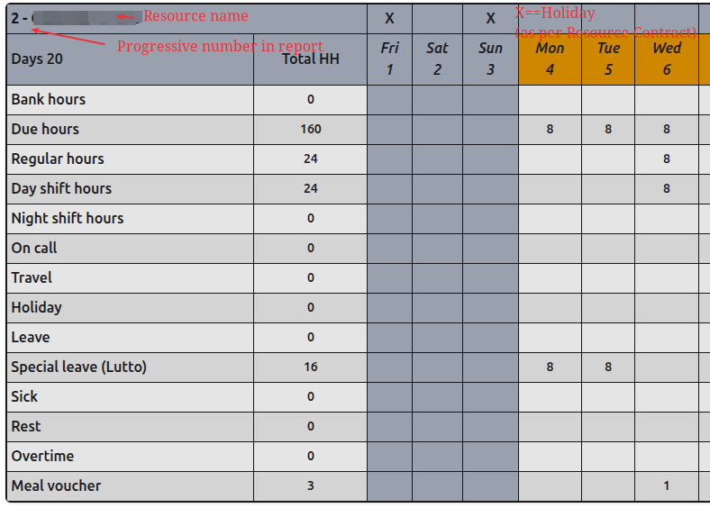

# Timesheet Report

The timesheet report is the most important report in the system for the timesheets.
Payslips are generated from this report.
The report is available as first menu entry in the menu `Reports`.

# Layout

There are several tables in the report: one for each Resource, sorted by Resource surname and name.
Only the Resources with 'Preferred in report' field set to 'Yes' are shown.

Example of table:

Each Resource table is organised as follows:

1st row:
  - A progressive number (in report) followed by the Resource surname and name.
  - An "X" denotes the corresponding day in the month (which is specified in row 2) is a holiday according to the Resource Contract Country Calendar.

2nd row:
  - Label "Days" followed by the number of the Resource _Working Days_ (see [Definitions](#definitions)) in the month.
  - Label "Total HH" (Total Hours) followed by the calendar days in the month. In this colum we will show the sum of the values in the columns 3 onwards.

Following rows (see [Definitions](#definitions)): Bank hours, Due hours, Regular hours, Day shift hours, Night shift hours, On Call, Travel, Holiday, Leave, Sick, Rest, Overtime, Meal Voucher

# General Definitions
  - Working Day: a day the Resource is expected to work according to its _Working Schedule_ (see following [Definition](#definitions))
  - Working Schedule: the number of hours the Resource is expected to work per week day (set in Resource Contract). [Due Hours calculations](#due-hours) may override this number in a calendar day.

# Definitions for each calendar Day

## Regular fields:

- Bank hours: A positive number shows the number of bank hours the Resource produced (deposits). A negative number shows the number of bank hours the Resource consumed (withdrawals).
- Due hours: The number of hours the Resource is expected to work in the day (see [Due Hours calculations](#due-hours)).
- Travel: The number of hours the Resource travelled in the day (denormalised from TaskEntry children).
- Day shift hours: The number of hours the Resource worked in the day during the Day Shift (denormalised from TaskEntry children).
- Night shift hours: The number of hours the Resource worked in the day during the Night Shift (denormalised from TaskEntry children).
- On Call: The number of hours the Resource was on call in the day (denormalised from TaskEntry children).
- Leave: The number of hours the Resource was on leave in the day.
- Special leave: The number of hours the Resource was on Special Leave in the day.
- Special leave Reason: The number of hours the Resource was on Special Leave in the day.
- Protocol Number: The protocol number for the Sick day
- Sick: The number of hours (equivalent to the expected Due Hours) the Resource was sick in the day.
- Rest: The number of hours the Resource was on rest in the day.
- Overtime: The number of hours the Resource earned as overtime in the day (see [Meal Voucher Calculations](#meal-voucher)).
- Meal Voucher: 1 if the meal voucher was earned by the Resource in the day (see [Overtime Calculations](#overtime)).
  
## Calculated properties:

- Holiday hours: The number of hours (equivalent to the expected Due Hours) the Resource was on holiday in the day.
- Worked hours: A property calculated as the sum of Day Shift + Night Shift + Travel Hours recorded in the TaskEntries
- Regular hours: A field representing the Resource _Worked hours_ + the bank daily balance up to maximum the expected number of hours (Due Hours).
- Remaining hours: The number of hours the Resource is expected to work in the day (Due Hours) minus the number of hours the Resource worked in the day, or 0 if the Resource worked more than the expected number of hours (Due Hours).
- Worked hours: 

# Rules

- A Resource cannot have concurrent Contracts

# Calculations

## Is Holiday

To determine if a day is a holiday for a Resource a Country Calendar Code can be set in the Contract.
If no Country Calendar is set then the default Country Calendar set for the site is used.
The resource contract has also an option to consider if Sundays are to be considered holiday days: there may be the case of contracts of resources that are doing shifts and the sunday is to be considered a regular day.

## Due Hours

In a calendar day:

- If the Resource has no Contract, OR the Resource is expected to be on holiday (according to the Country Calendar, not if the Resource requested a holiday for the day) then Due Hours = 0 (Sundays are considered as Holidays if flag Contract.sunday_as_holiday is True - which is the default).

Else

- The Due Hours value is defined in the Resource Contract Working Schedule if it is set, else it is as per the Default Working Schedule set for the site (typically 8 hours per day, Mon-Fri).

## Overtime

The basic value for overtime is calculated as: _Day shift hours_ + _Night shift hours_ + _Travel_ - _Due Hours_
If such value is 0 or negative then the _Overtime_ value is 0.

## Meal Voucher

To earn a meal voucher, the Resource must have the "meal_voucher" schedule set in the Contract and
must have worked in the day (_Day shift hours_ + _Night shift hours_ + _Travel_) at least the threshold specified in the schedule for the day.
