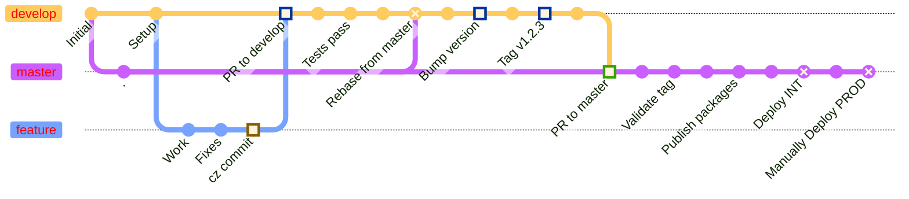

# New Release Workflow (proposal)

## TLDR

Agreed on a classic trunk-based solution for the automatic deployment and release in INT and PROD:

- **Manual bump in develop**: Bump version manually in develop branch
- **PR from develop to master**: Create a PR with a new tag that (upon merge) will trigger automatic deployment and release in INT
- **Manual PROD deployment**: Deploy in PROD manually with an action that allows selecting the version to promote
- **Authorized users only**: PROD deployment can only be triggered by authorized users (Gio, Enzo, Raf, Simone)

## Overview

Meeting with @SimoneMartinotti and @epastorellik-techit to discuss how to properly automate the release workflow of KRM3 in INT (krm3int.k-tech-it) and PROD (krm3.k-tech.it).

## Proposed Workflow

We agreed to pursue the following flow:

1.  **Feature/Bug Development & PR to develop**

    Upon completion of features/bugs, developers will open a PR toward the `develop` branch, having a commit done with `cz commit`. Test and security pipelines start and it would be possible to merge only if those checks are passed.

2.  **Code Review & Merge**

    PR will be reviewed and approved by senior devs. Once approved, the PR would be merged in `develop` without triggering any pipeline.

3.  **Release to Integration (INT)**

    Once we agree to release in integration environment (krm3int) starting from the `develop` branch:

    - First, rebase `develop` upon `master` to get the previous version tags and commits
    - Then bump the new version
    - Finally, open a PR from `develop` to `master`
    - Only authorized users may approve the PR to merge `develop` into `master`
    - Manual push to the `master` branch should not be allowed, but it might be allowed for exceptional purposes only to authorized users

    **Authorized users**: Gio, Enzo, Raf, Simone

4.  **Automated INT Deployment**

    Upon merging, a pipeline will:

    - Validate the new tag (if validation fails, the pipeline will not continue)
    - Publish the new artifact in GitHub packages
    - Release via the Rancher API in the container krm3int

5.  **Manual PROD Promotion**

    Once we decide to promote a version in PROD, there will be a manual action that can be triggered only by authorized devs. This action will:

    - Allow selection of which version to promote in PROD
    - Select the image that matches the version
    - Release it in the PROD container

    **Authorized users**: Gio, Enzo, Raf, Simone

## Workflow Diagram

