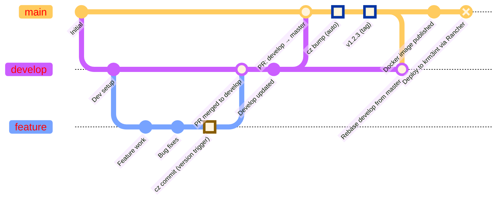

The flow to release a new version and automatic deployment into the `krm3int` environment is the following:

- Open a PR from a branch which contains your feature/bugfix etc. specifing the `develop` target branch
- Make sure it contains a commit (using `cz commit`) that will trigger the new version bump (see [here](/guides/developers/commit/) for details)
- Once the PR has been reviewed and accepted your code is merged into `develop`
- To perform the release and deploy open a PR from `develop` to `master`, upon merge the release pipeline will perform the `cz bump` command in the `master` branch, bumping the new version (that in turn is a commit created automatically with a tag containing the new version), push the bump commit (and it's associated tag) in `master` branch and rebase the `develop` branch from the `master` in order to keep the two branches aligned.
- Once the new version is bumped the pipeline will publish the docker image in the [images registry](https://github.com/k-tech-italy/krm3/pkgs/container/krm3) (a.k.a. GitHub package) and after that release the image in the Kubernetes cluster using the Rancher API

